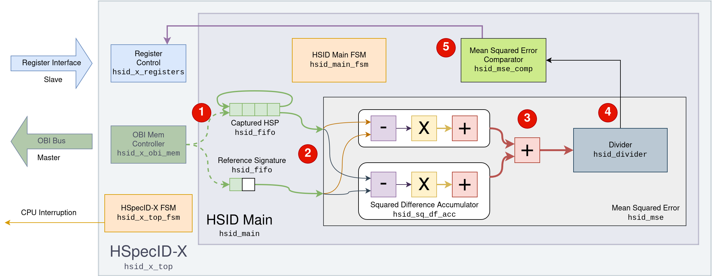

# Architecture

The figure below shows the modules that compose the **HSpecID-X** accelerator
and the path followed by the **HSPs**, from memory reading to the retrieval of
the minimum **MSE** value. Control signals have been omitted to avoid
overloading the diagram. 

{ .center width=95% }

The accelerator is configured through the slave *Register Interface*, using the
addresses assigned in the integration project. The reading of the captured
**HSPs** and the spectral library from memory is performed through the master
**OBI** bus.

The process follows four main steps:

1. The captured **HSP** is fully transferred to the **FIFO**.  
2. Next, the spectral library transfer begins. As data arrives, it is injected into the **MSE** module to compute all intermediate accumulators of channel 1 and 2.
3. Each time the transmission of a spectral signature is completed, the **MSE** is computed by summing the intermediate accumulators and dividing the result by the number of bands using an integer divider module.
4. Finally, the computed **MSE** value is compared with the previous results to detect the maximum and minimum values, which are sent to the *Register Control*.

## Modules design

The modules that comprise the accelerator connected to **X-HEEP** are listed
below, which are presented from the bottom up, in accordance with the
*bottom-up* design methodology.  

The developed modules are located in the `hw` directory, each containing a
subdirectory for the **RTL** code (`rtl`) and another for *testbenches* and
verification (`tb`).  

The table below summarizes the implemented modules, indicating their name, code
identifier, and location within the accelerator hierarchy.

| Name                           | Code                                             | Location           |
| ------------------------------ | ------------------------------------------------ | ------------------ |
| FIFO                           | [`hsid_fifo`](design/hsid_fifo.md)               | Main core          |
| Squared Difference Accumulator | [`hsid_sq_df_acc`](design/hsid_sq_df_acc.md)     | Main core          |
| Divisor                        | [`hsid_divisor`](design/hsid_divider.md)         | Main core          |
| Mean Squared Error             | [`hsid_mse`](design/hsid_mse.md)                 | Main core          |
| Mean Squared Error Comparator  | [`hsid_mse_comp`](design/hsid_mse_comp.md)       | Main core          |
| HSID Main                      | [`hsid_main`](design/hsid_main.md)               | Main core          |
| Register Control               | [`hsid_x_registers`](design/hsid_x_registers.md) | X-HEEP integration |
| OBI Memory Controller          | [`hsid_x_obi_mem`](design/hsid_x_obi_mem.md)     | X-HEEP integration |
| HSpecID-X                      | [`hsid_x_top`](design/hsid_x_top.md)             | X-HEEP integration |

