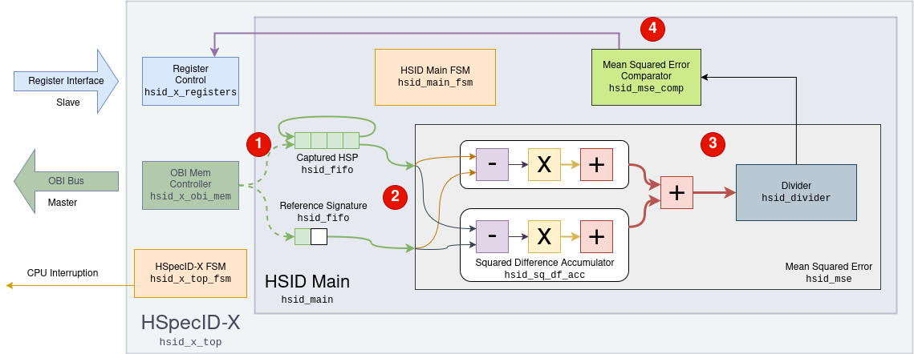
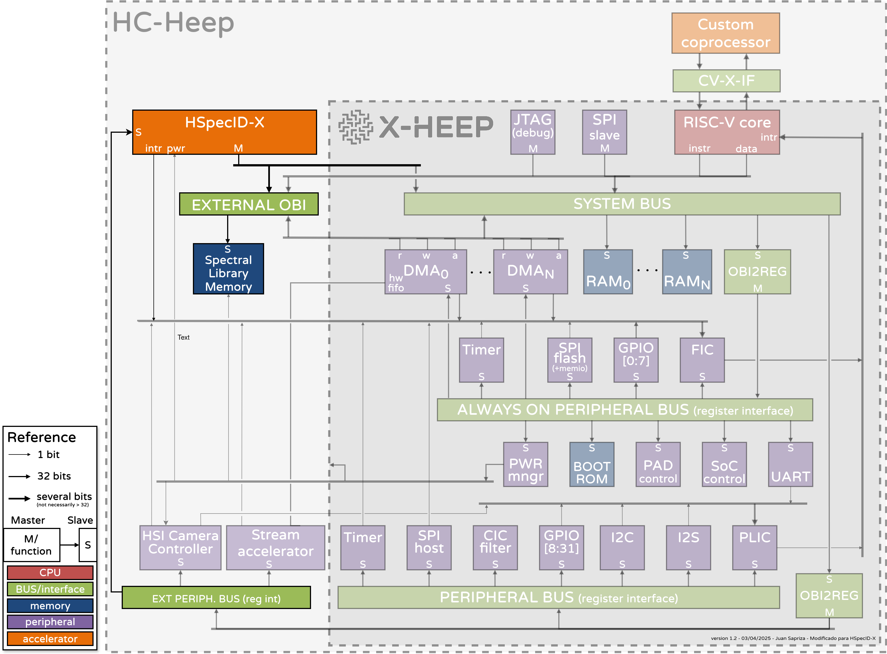

# Architecture

<figure id="fig-hsid-x-arch">
  
  <figcaption>Figure 1 — HSpecID-X module and dataflow diagram</figcaption>
</figure>

[Figure 1](#fig-hsid-x-arch) shows the modules that compose the **HSpecID-X** accelerator and the path followed by the **HSPs**, from memory reading to the retrieval of the minimum **MSE** value.  
Control signals have been omitted to avoid overloading the diagram.  
The accelerator is configured through the slave *Register Interface*, using the addresses assigned in the integration project.  
The reading of the captured **HSPs** and the spectral library is performed through the master **OBI** bus.

The process follows four main steps:

1. The captured **HSP** is fully transferred to the **FIFO**.  
2. Next, the spectral library transfer begins. As data arrives, it is injected into the **MSE** module to compute all intermediate accumulators of channel 1 and 2.
3. Each time the transmission of a spectral signature is completed, the **MSE** is computed by summing the intermediate accumulators and dividing the result by the number of bands using an integer divider module.
4. Finally, the computed **MSE** value is compared with the previous results to detect the maximum and minimum values, which are sent to the *Register Control*.

---

<figure id="fig-hc-heep">
  
  <figcaption>Figure 2 — Possible integration of HSpecID-X with X-HEEP</figcaption>
</figure>

[Figure 2](#fig-hc-heep) shows a possible integration of the **HSpecID-X** accelerator within the [**X-HEEP**](https://x-heep.readthedocs.io/en/latest/index.html) architecture using XAIF interface.
