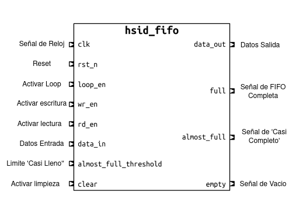
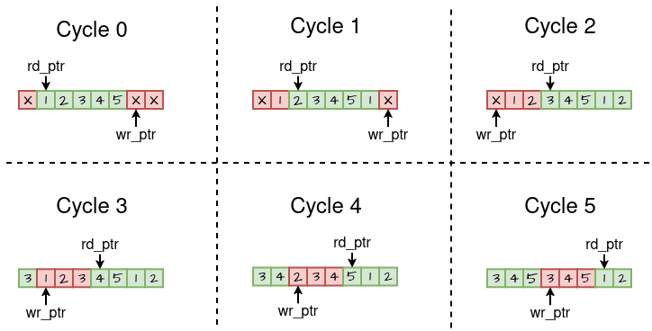

# FIFO (`hsid_fifo`) {#hsid_fifo}

The main purpose of this **FIFO** is to serve as internal memory for storing the
captured **HSP**. This HSP must be compared with *m* pixels from the spectral
library. By storing it in the FIFO, repeated memory reads *m* times are avoided.

{ .center width=70% }

The figure above shows the input and output signals of the module. The output
signals `full` and `empty` are asserted when the FIFO is either full or empty,
respectively. The `almost_full` signal is asserted when the FIFO contains as
many elements as specified by the `almost_full_threshold` signal. This
functionality is relevant when the number of bands in the captured HSP does not
reach the FIFO’s maximum capacity.

| Operation    | Priority | `clear` | `loop_en` | `wr_en` | `rd_en` |
| ------------ | -------- | ------- | --------- | ------- | ------- |
| Clear        | 1        | 1       | X         | X       | X       |
| Loop         | 2        | 0       | 1         | X       | X       |
| Write        | 3        | 0       | 0         | 1       | 0       |
| Read         | 3        | 0       | 0         | 0       | 1       |
| Write / Read | 3        | 0       | 0         | 1       | 1       |

The use cases are summarized in the table above. The operations *clear*,
*write*, *read*, and *write/read* are typical of any FIFO. The *loop* operation
means that the data being read is immediately written back into the FIFO as its
last element. In this case, the operation completes in a single cycle, during
which the input port signal `data_in` is ignored. The figure below shows the
internal state of the fifo memory, and the *wr_ptr* 

{.center width=95%}
