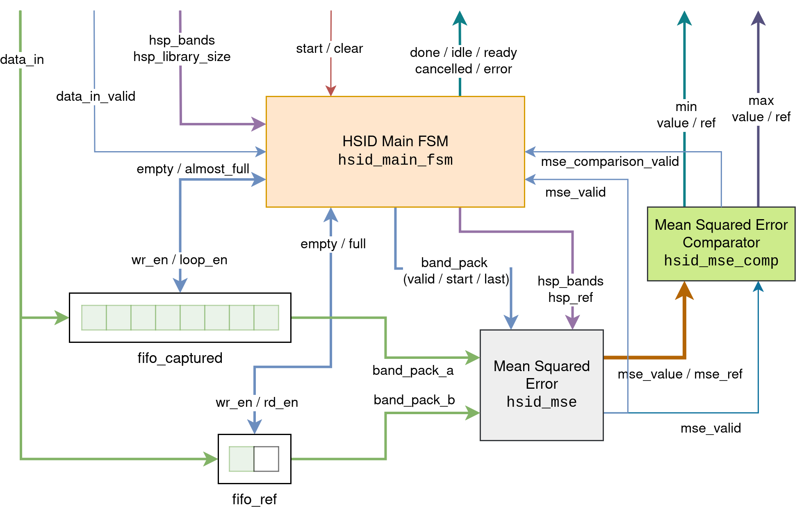
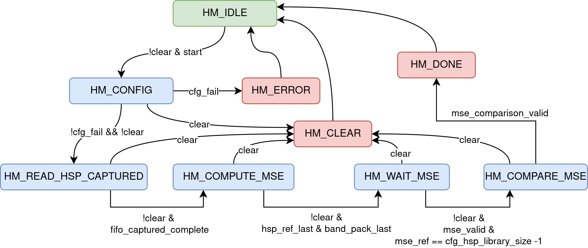
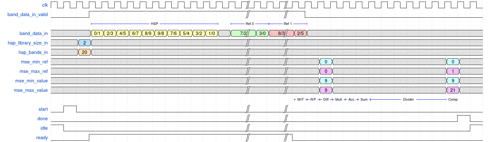

# HSID Main (`hsid_main`) {#hsid_main}

This module integrates the modules described previously and serves as the main
**IP** core of the project. Using input data from the **HSPs** and reference
signatures, it determines which reference signature most closely matches the
captured **HSP**. The different modules are interconnected as shown in the
figure below, in which signals are grouped semantically to avoid cluttering the
diagram.

{.center width=95%}

The synchronization of internal processes is managed by an **FSM** implemented
in the `hsid_main_fsm` module. The table and figure below summarizes the
function of each FSM state and its the corresponding FSM graph.

| State                  | Description                                                             |
| ---------------------- | ----------------------------------------------------------------------- |
| `HM_IDLE`              | Idle state                                                              |
| `HM_CONFIG`            | Register `hsp_bands` and `hsp_library_size`                             |
| `HM_READ_HSP_CAPTURED` | Write the captured **HSP** into the **FIFO**                            |
| `HM_COMPUTE_MSE`       | Write the reference signature into the **FIFO** and compute the **MSE** |
| `HM_WAIT_MSE`          | Wait until the last **MSE** computation is complete                     |
| `HM_COMPARE_MSE`       | Wait until the last **MSE** comparison is complete                      |
| `HM_DONE`              | Process complete                                                        |
| `HM_CLEAR`             | Cancel the process                                                      |
| `HM_ERROR`             | Configuration error                                                     |

{.center width=95%}

The internal state of the module is exposed through the block control interface
(*handshake*) via the signals `idle`, `ready`, `done`, `cancelled`, and `error`.
The table below lists the values of these signals depending on the current FSM
state.

| State                  | `idle` | `ready`          | `done` | `cancelled` | `error` |
| ---------------------- | ------ | ---------------- | ------ | ----------- | ------- |
| `HM_IDLE`              | 1      | 0                | 0      | 0           | 0       |
| `HM_CONFIG`            | 0      | 0                | 0      | 0           | 0       |
| `HM_READ_HSP_CAPTURED` | 0      | 1                | 0      | 0           | 0       |
| `HM_COMPUTE_MSE`       | 0      | `!fifo_ref_full` | 0      | 0           | 0       |
| `HM_WAIT_MSE`          | 0      | 0                | 0      | 0           | 0       |
| `HM_COMPARE_MSE`       | 0      | 0                | 0      | 0           | 0       |
| `HM_DONE`              | 0      | 0                | 1      | 0           | 0       |
| `HM_CLEAR`             | 0      | 0                | 0      | 1           | 0       |
| `HM_ERROR`             | 0      | 0                | 0      | 0           | 1       |

Assuming there are *m* reference signatures and each **HSP** contains *n* bands,
the estimated latency in cycles for this module is given by:

$$
\frac{n}{2} + \frac{nm}{2} + 7 + (K + 1)
$$

The constant term 7 accounts for the final operations, which include: reading
from the **FIFO**, subtraction, multiplication, accumulation, accumulator
summation, comparison, and assertion of the `done` signal. The other $K + 1$
cycles depends on the dimension of the module `hsid_divider`. The figure below
shows an example waveform for an **HSP** with 10 bands and 2 reference
signatures using a 5-bit divider. There is also some description of the final
steps in the pipelines.

{.center width=100%}