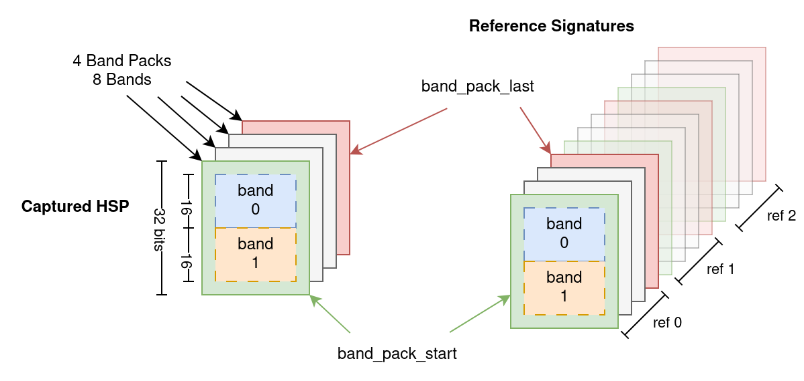
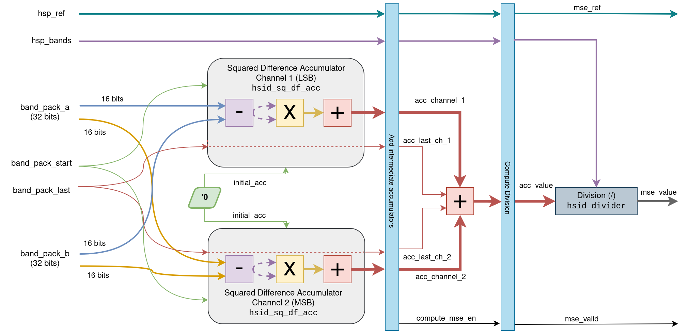
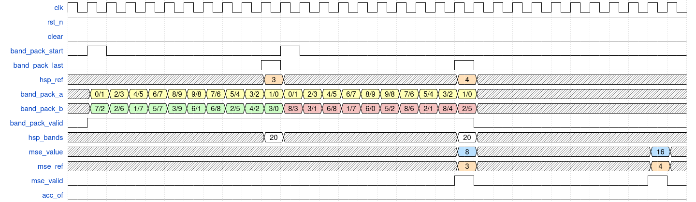

# Mean Squared Error (`hsid_mse`)
The purpose of this module is to complete the **MSE** computation between the
captured **HSP** and a reference signature from the spectral library. The data
input width is 32 bits, meaning that two consecutive bands are introduced
simultaneously for both the captured HSP and the reference signature. The figure
below shows how the beginnings and ends of each HSP are delimited. Each
reference signature is associated with an identifier (`hsp_ref`) corresponding
to its position in the spectral library.

{.center width=95%}

Since the data input provides two consecutive bands, processing can be performed
in parallel using two instances of the [`hsid_sq_df_acc`](hsid_sq_df_acc.md)
module. The intermediate accumulated results obtained from both instances are
added together and finally divided by the number of bands in the HSP. The
dataflow of the `hsid_mse` module is illustrated in the following figure.

{.center width=95%}

For an HSP of *n* bands, the latency of this module is $\frac{n}{2} + 4 + (K +
1)$ cycles: $\frac{n}{2}$ cycles for transferring the `band_packs`, plus four
cycles to complete the [`hsid_sq_df_acc`](hsid_sq_df_acc.md) *pipeline* and the
final accumulator, and $K + 1$ cycles to perform the division yielding a
`K`-bit result within the `hsid_mse` module. Both **HSP** and reference
signature must contain more than $4 (K + 1)$ bands to avoid issues with
`hsid_divider` as this module is not pipelined.

The figure below shows an example waveform illustrating the computation of the
MSE for two consecutive reference signatures using the `hsid_divider` module
with a divider of 5 bits.

{.center width=95%}