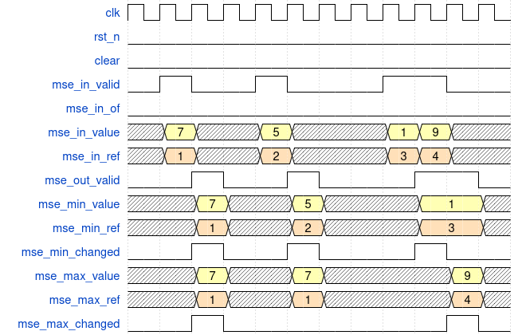

# Mean Squared Error Comparator (`hsid_mse_comp`) {#hsid_mse_comp}

Once the **MSE** value is obtained, it is necessary to identify which reference
signature most closely matches the captured **HSP**. This module maintains a
record of the minimum and maximum MSE values, along with the corresponding
reference signature identifiers.

If the input MSE value (`mse_in_value`) is less than or equal to the currently
stored minimum, the minimum value and its identifier are updated. Similarly, if
the input value is greater than or equal to the stored maximum, the maximum
value and its identifier are updated. If the overflow signal `mse_in_of` is
asserted, the input value is discarded.

Results are produced one cycle after a valid input is received, as shown in the
figure below. When either the minimum or maximum value is updated, this event is
indicated by the `mse_min_changed` and `mse_max_changed` output signals,
respectively.

{.center width=95%}