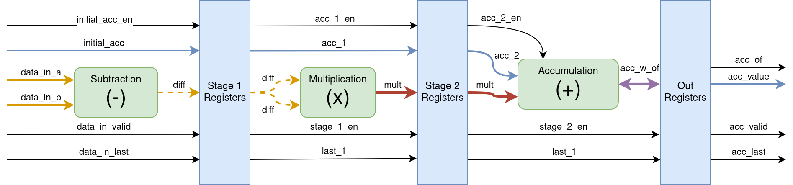
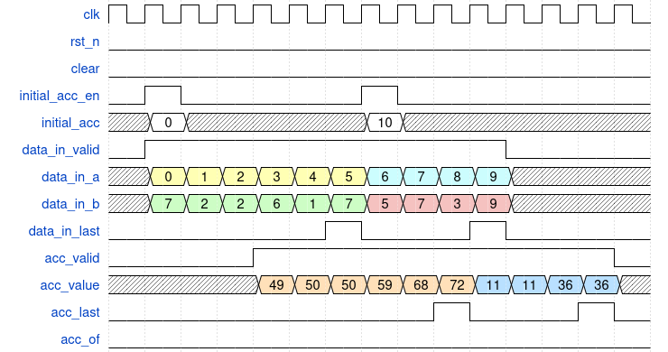

# Squared Difference Accumulator (`hsid_sq_df_acc`) {#hsid_sq_df_acc}

The purpose of this module is to compute the difference between two bands,
square it, and accumulate the result with previous values. To achieve a
*throughput* of one result per cycle, the module is designed with a segmented
data path organized into a three-stage *pipeline*.

The figure below shows this *pipeline* structure and the operations performed in
each stage. In the first stage, subtraction is performed; in the second,
multiplication; and in the third, intermediate accumulation.

{.center width=95%}

The result of the subtraction is stored in an intermediate register of the same
bit width as the input values but of type `signed`. To prevent overflow, the
multiplication result must be twice the input bit width.

The accumulator is initialized through the input signals `initial_acc_en` and
`initial_acc`. These signals propagate through the *pipeline* to the final
stage, where the control logic determines whether to accumulate over the
previous values or use the initial accumulator. An accumulation may cause an
*overflow*, which is indicated by the output signal `acc_of`. This signal is
reset when `initial_acc_en` is asserted.

The signal `data_in_last` indicates that the input corresponds to the final band
of the **HSP**. In this way, the final accumulated value can be identified
through the output signals `acc_last` and `acc_valid`.

The figure below illustrates a waveform example showing the accumulation process
for two sequences of numbers with different initial values. The latency of this
module is 3 cycles[^1]. Therefore, although intermediate accumulated results are
produced every cycle, the effective *throughput* is one result per cycle.

{.center width=95%}

[^1]: We are supposing that the latency of the multiplication is the only one cycle, and that can be true if you're using DSP units. Other possiblity is to use a pipelined multiplication module.