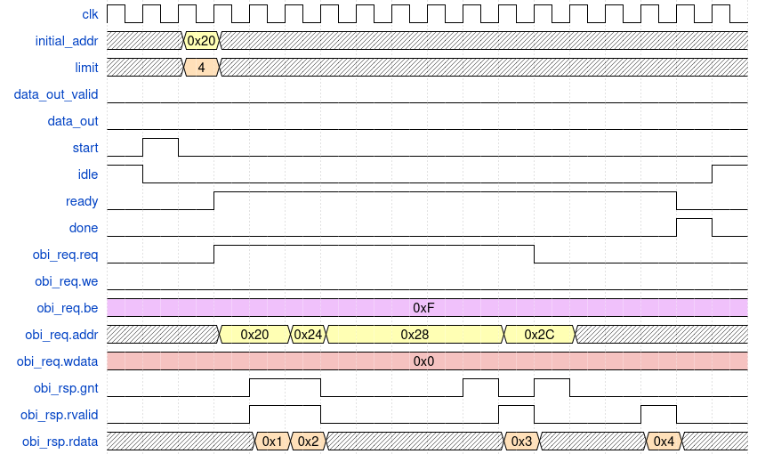
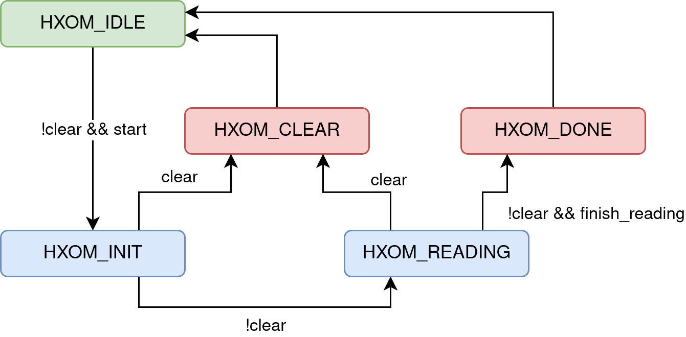

# OBI Memory Controller (`hsid_x_obi_mem`) {#hsid_x_obi_mem}

This module performs memory read requests through the [**OBI**
bus](https://github.com/openhwgroup/obi/blob/072d9173c1f2d79471d6f2a10eae59ee387d4c6f/OBI-v1.6.0.pdf),
starting from an initial address and continuing for a specified number of reads.

At the **RTL** level, access to the **OBI** interface is implemented using a
structure derived directly from the **X-HEEP** project, similar to the *Register
Interface* described in the module [`hsid_x_registers`](hsid_x_registers.md). The
structure is defined in the package `hsid_x_obi_inf_pkg.sv`, located in the
directory `hw/src/hsid_pkg/rtl`.

Memory read requests are issued according to the **OBI** protocol. A read
request for a 32-bit word is initiated by asserting the signals `req = 1`, `we =
0`, and `be = 0xF`, and by placing the desired address on `addr`. Once the
request is accepted, the memory address is incremented by 4, and the process is
repeated until the required number of requests has been issued. For each
accepted request, the module waits to receive a response from the bus.  
The figure below shows an example of four consecutive memory reads.

{.center width=95%}

The control of these read operations is implemented through a simple **FSM**,
shown in the figure below. In the `HOXM_INIT` state, read requests are prepared
using the initial address provided by the `initial_addr` signal. The module then
transitions to the `HOXM_READING` state, during which consecutive read requests
are issued until the final valid memory response is received.

{.center width=75%}