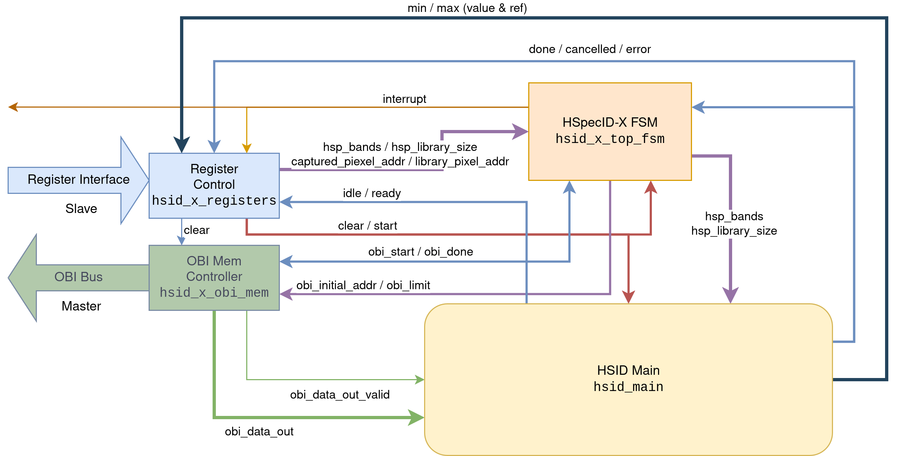
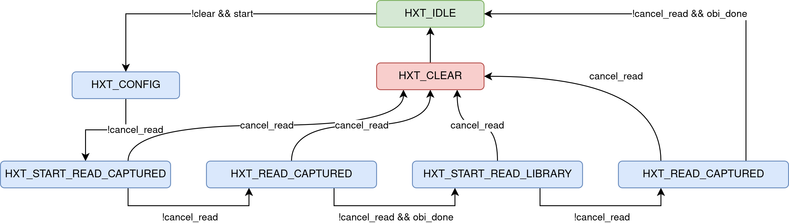

## HSpecID-X (`hsid_x_top`) {#hsid_x_top}

This module serves as the project’s top-level integration unit, incorporating
all previously described components. The figure below shows the integration
diagram, in which signals are semantically grouped to simplify the
representation.

{.center width=95%}

The synchronization between memory read operations and data injection into
`hsid_main` is managed by an **FSM**, shown in the figure below:

{.center width=95%}

This module can be directly integrated into an **X-HEEP**-based **SoC**. Once
configured and assigned memory-mapped addresses within the SoC, it can be
controlled from a C application according to the register *offsets* described in
the [`hsid_x_ctrl_reg` documentation](hsid_x_ctrl_reg.md).

First, the software must configure the execution parameters: the number of bands
per **HSP** (`PIXEL_BANDS`), the number of reference signatures in the spectral
library (`LIBRARY_SIZE`), and the memory addresses of the captured **HSP** and
the spectral library (`CAPTURED_PIXEL_ADDR` and `LIBRARY_PIXEL_ADDR`).

Once the parameters are configured, the operation begins by setting the `START`
bit of the `STATUS` register to `1`. Upon completion, the accelerator issues an
interrupt to the processor. The accelerator’s state can be queried through the
`STATUS` register, whose main bits are:

- `IDLE`: indicates that the accelerator is inactive.  
- `DONE`: indicates that the last operation completed successfully.  
- `CANCELLED`: indicates that the current operation was cancelled.  
- `ERROR`: indicates that the initial configuration is invalid.

The ongoing operation can also be cancelled by setting the `CLEAR` bit of the
`STATUS` register to `1`. In this case, the dataflow is stopped, and all
internal registers are reset to their default values.

Finally, the results of the last operation are accessible via software.  The
`MSE_MIN_REF` and `MSE_MIN_VALUE` registers indicate the spectral signature that
most closely matches the captured **HSP**, while `MSE_MAX_REF` and
`MSE_MAX_VALUE` store the signature that differs the most.