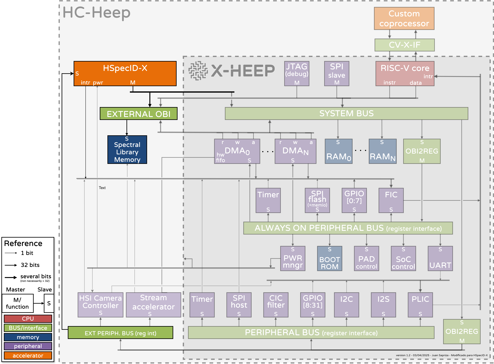

# Possible integration with X-HEEP

This figure shows a possible integration of the **HSpecID-X** accelerator within the [**X-HEEP**](https://x-heep.readthedocs.io/en/latest/index.html) architecture using XAIF interface. If you want to learn more about how to do it, you should check out [eXtending X-HEEP — X-HEEP 1.0 documentation](https://x-heep.readthedocs.io/en/latest/Extending/index.html)

{.center width=95%}