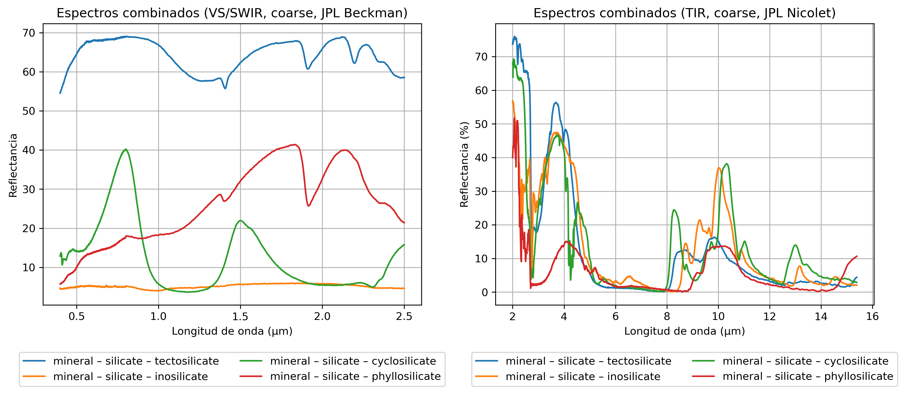
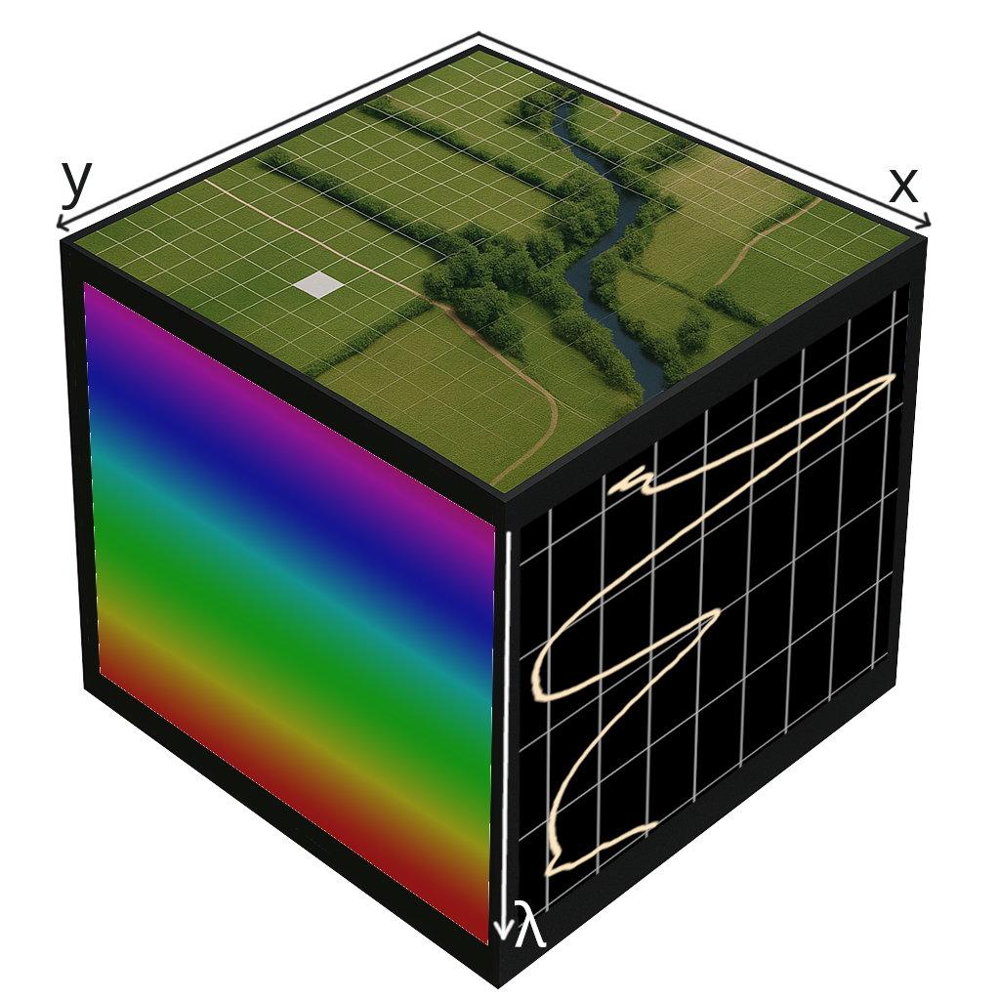

## Introduction

### Electromagnetic Spectrum and Spectral Libraries

The electromagnetic spectrum comprises all frequencies at which electromagnetic
radiation can propagate as a wave. Using a spectrometer, it is possible to
measure the light intensity of an emitting or reflecting object at each
wavelength. Once this information is obtained—and the observed material is
known—it is possible to generate a characteristic spectrogram for each type of
material.

Libraries exist that collect spectrograms of numerous materials for use as
reference sources. These libraries have been created using different observation
techniques across various wavelength ranges. For example, the [**ECOSTRESS**
Spectral Library](https://speclib.jpl.nasa.gov/) includes more than 3,000
spectrograms of both natural and artificial materials. The wavelength ranges
covered by this library are **VIS/SWIR** (0.35–2.5 μm) and **TIR** (2.5–15 μm).

{: width=90% .center }

These spectrograms differ significantly, even among materials from the same
category. Ultimately, they can be considered as reference signatures or
"fingerprints" of the materials. Therefore, if the spectrogram of an observed
object is acquired, its composition and nature can be determined.

### Hyperspectral Cameras and Images

These spectrograms are acquired using spectrometers or hyperspectral cameras.
The main difference is that a hyperspectral camera can capture two-dimensional
images that combine spatial and spectral information for each pixel. This
enables the identification of material composition at specific positions within
the image.

A **hyperspectral image (HSI)** can be represented as a data cube: two
dimensions correspond to spatial information, while each **hyperspectral pixel
(HSP)** contains the intensity of multiple narrow spectral bands within a
defined wavelength range.

{ width=50% .center }

Unlike an RGB image, which collects information from only three broad spectral
bands in the visible range (red, green, and blue), a hyperspectral image can
contain hundreds of narrow bands across the visible, infrared, or other regions
of the spectrum.

Hyperspectral cameras acquire HSIs using two techniques: **snapshot**, in which
all pixel information is captured simultaneously, and **scanning**, in which
data is acquired pixel by pixel. The latter technique provides higher precision
but results in slower acquisition speeds.

### Hyperspectral Image Processing

Once HSIs are acquired, they must be processed to extract relevant information.
A single HSI can contain hundreds of megabytes of data, making processing
computationally demanding.

The application domains for HSIs are highly diverse: agricultural monitoring,
detection of toxic substance leaks, security, and even medicine and biological
analysis in laboratories. HSIs are also used for large-scale terrain
exploration, as well as in the study of inaccessible environments such as
asteroids and other planets.

Some classification and change detection algorithms rely on **convolutional
neural networks (CNNs)**, which require powerful GPU-based workstations to
process the large volume of HSI data.

However, many hyperspectral cameras are installed on satellites or UAVs, where
onboard processing must occur under tight resource constraints. These embedded
systems often rely on low-power processors without GPUs. Therefore, tasks such
as preprocessing, lossless compression, or basic classification can be offloaded
to hardware accelerators implemented in FPGAs or ASICs.

A simple classification approach is to use the **Mean Squared Error (MSE)** to
quantify the difference between two vector measurements, one of which serves as
a spectral reference.

### Mean Squared Error (MSE) {#sec-mse}

HSPs can be considered as vectors, where each index corresponds to a narrow
spectral band and the associated value represents the normalized light intensity
at that band. To compare two HSPs, they must contain measurements for the same
bands and have equal length.

If two HSPs are of equal length, their difference can be measured by computing
the squared error: subtracting each pair of corresponding values and squaring
the result. This emphasizes large discrepancies while reducing the influence of
smaller ones.

The **MSE** is a statistical measure that calculates the average of the squared
errors between two vectors. Given a reference signature $r = (r₁, r₂, …, rₙ)$
and a captured HSP $x = (x₁, x₂, …, xₙ)$, the MSE is defined as:

$$
\text{MSE}(x, r) = \frac{1}{N} \sum_{i=1}^{N} (x_i - r_i)^2
$$

To identify a captured HSP among reference signatures in a library, the MSE
should be minimized. A value of 0 indicates that the spectrograms are identical,
which implies a perfect match and enables precise material identification.

Other metrics used to evaluate similarity include the **Mean Absolute Difference
(MAD)** and the **Spectral Angle Mapper (SAM)**.

Although conceptually simple, these algorithms are computationally intensive,
involving numerous subtraction and multiplication operations. As such, executing
them on general-purpose processors—where operations are performed
sequentially—is inefficient. An effective alternative is the use of
**Domain-Specific Accelerators (DSAs)**, which exploit the inherent parallelism
of these algorithms.

### Domain-Specific Accelerators (DSA)

General-purpose processors execute applications by interpreting instructions
stored in memory. Their architectures are versatile and flexible, making them
suitable for a wide range of tasks. However, this
flexibility limits their efficiency when performing highly parallel or
computationally intensive operations.

To improve efficiency in such scenarios, systems often integrate **hardware
accelerators**. These components are specialized to perform a specific task more
efficiently than a general-purpose processor. Two widely known types are
**GPUs**, commonly used for graphics rendering and AI workloads, and **DSAs**,
typically implemented in FPGAs or ASICs.

A **DSA** is a hardware module tailored to a specific computational task. It
features optimized data paths and control logic designed for a narrowly defined
use case. Although DSAs lack the flexibility of general-purpose processors, they
achieve high performance by executing operations in parallel and using memory
architectures that support the algorithm’s structure.

## Technological context

### RISC-V

**RISC-V** is an open **Instruction Set Architecture (ISA)** based on the
**Reduced Instruction Set Computing (RISC)** paradigm. It originated in 2010 at
the University of California, Berkeley, as an academic project aimed at
supporting education and research. Today, the development and maintenance of its
specifications are overseen by [**RISC-V International**](https://riscv.org/).

One of RISC-V’s most significant features is its modularity. Processor
developers can select which standards and extensions to implement. For example,
a processor that supports only the [basic RV32I
standard](https://github.com/rbarzic/nanorv32) is much simpler to implement than
[one that includes multiple
extensions](https://github.com/openhwgroup/cv32e40x), resulting in lower power
consumption but also reduced computational capacity and flexibility.

As an open and royalty-free standard, RISC-V has emerged as a prominent
alternative to proprietary ISAs such as x86 and ARM, particularly in academic
research and processor development. It also serves as the foundation for
platforms such as **X-HEEP**, which is used in this project.

### X-HEEP

[**X-HEEP**](https://x-heep.readthedocs.io) is an extensible, open-source
**System-on-Chip (SoC)** platform that enables the creation of customized
embedded systems based on RISC-V processors. Its main features include low power
consumption and highly parameterized peripherals, allowing the system to be
adapted to a wide range of performance and efficiency requirements. For these
reasons, it is well suited for integrating accelerators, memory blocks, and
application-specific peripherals.

The architecture of X-HEEP is organized into four power domains: the CPU, memory
banks, peripheral systems, and always-on peripheral systems. Some peripherals
can be disabled at runtime, enabling significant power savings. The system can
also be extended through the inclusion of custom coprocessors or accelerators
via the
[**XIF**](https://docs.openhwgroup.org/projects/openhw-group-core-v-xif/en/latest/intro.html)
and **XAIF** protocols, which were designed for this purpose.

Customization of the SoC is performed through scripts that allow users to select
the processor, memory size and type, and assign peripherals to memory-mapped
addresses for software access. It is also possible to embed the software to be
executed on the SoC, either as a bare-metal program or an **RTOS**.

Once the customized SoC is configured and verified with the required
peripherals, it can be synthesized onto an FPGA for rapid prototyping or
fabricated as an ASIC for deployment. A notable example is
[**HEEPocrates**](https://www.epfl.ch/labs/esl/research/systems-on-chip/heepocrates/),
an ASIC for edge computing in healthcare that integrates X-HEEP with a **CGRA**
and an **IMC** accelerator.

### eXtended Accelerator Interface (XAIF)

The **XAIF** interface enables the integration of custom accelerators into the
X-HEEP platform without requiring modifications to the base RTL code. It
consists of the following components:

- **Master/slave ports**, which are memory-addressable interfaces that
  communicate via the [**OBI**
  bus](https://github.com/openhwgroup/obi/blob/main/OBI-v1.6.0.pdf) or through
  the [**Register Interface**](https://github.com/pulp-platform/register_interface).
- **Interrupts**, which allow the accelerator to notify the processor of specific events.
- **Power control ports**, which enable X-HEEP to manage the accelerator’s power consumption.

### RTL Designs vs. High-Level Synthesis (HLS)

Modern hardware designs can be derived from high-level algorithm descriptions
written in languages such as C++ or SystemC using **High-Level Synthesis (HLS)**
tools. This development approach significantly reduces implementation time and
facilitates architectural exploration. However, it may lead to lower efficiency
in terms of area and latency when compared to manually written RTL designs.

In this project, a direct RTL design approach was chosen to allow fine-grained
control over the architecture, dataflow, and resource utilization. Additionally,
this approach enables the definition of a modular, reusable, and adaptable
system for future projects or for integrating other HSP classification
algorithms. In summary, design efficiency was prioritized over rapid development
via HLS tools.
