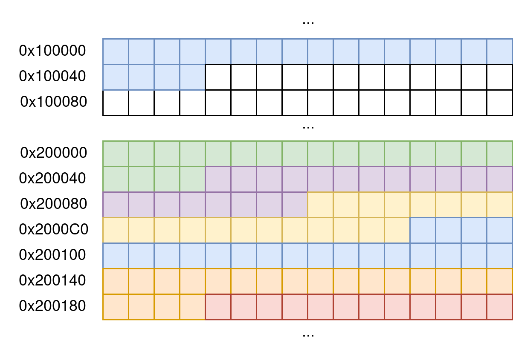

## Requirements Analysis

The project requirements are divided into two main categories: **functional**
and **non-functional**. This classification distinguishes between the specific
capabilities the accelerator must provide and the quality attributes,
adaptability, and constraints of its implementation.

### Functional Requirements

#### Software Configuration

The accelerator is configured via software using the [**Register
Interface**](https://github.com/pulp-platform/register_interface). The input
parameters include: the number of bands in the HSPs, the number of reference
signatures in the spectral library, and the memory addresses of the captured HSP
and the spectral library.

The accelerator’s status can be queried through a status register composed of
several bits — some writable and others read-only. The writable bits allow
starting and stopping the accelerator, while the read-only bits report its
current status (*idle*, *ready*) and indicate how the last operation ended
(*done*, *error*, *cancelled*).

Additionally, four registers identify the reference signature that most closely
matches the captured HSP and the one that differs the most. For each, both the
identifier and the calculated MSE value are provided.

#### Spectral Library Memory Structure {#sec-lib-ref-mem}

The spectral library must be stored in memory following certain constraints to
ensure compatibility with the accelerator. Multiple libraries can coexist in
memory, each with its own starting address. Reference HSPs must contain the same
number of bands as the captured HSPs, and their bands must appear in the same
order and correspond to the same wavelengths. All reference signatures within
the same library must be stored in consecutive memory locations.

The accelerator targets X-HEEP systems with 32-bit RISC-V processors. In this
case, each memory word packs two consecutive bands of an HSP. If the number of
bands is odd, the least significant part of the last word is padded with zeros.

{ width=80% .center}

In systems with 64-bit processors, four bands could be packed per word. However,
supporting this would require RTL code modifications, which are outside the
scope of this project.

#### Transfer of HSPs to the Accelerator

HSPs can be transferred to the accelerator using either a **passive (slave)** or
**active (master)** approach. In passive mode, the accelerator waits to receive
data via the OBI bus — either from a DMA or via processor-controlled transfers.
In active mode, the accelerator knows the memory addresses of the captured HSP
and the spectral library, and directly fetches data via a master controller.

In the HSpecID-X design, active mode is preferred to reduce reliance on external
software or DMA controllers.

#### `Clear` Function in All Modules

All modules must implement a *clear* function that resets internal registers to
their default values, cancels ongoing pipeline operations, and restores state
machines to their initial states. This function has the highest priority within
each module.

#### Integer Arithmetic Operations

This version of the accelerator uses integer arithmetic units for addition,
subtraction, multiplication, and division, implemented using SystemVerilog's
built-in operators.

Addition, subtraction, and multiplication can be synthesized using DSP blocks,
enabling single-cycle execution. In contrast, division requires multiple cycles
and a dedicated implementation module. However, this lies outside the scope of
the current project.

#### Clock and Reset Signals

All RTL modules are synchronized to the rising edge of a single clock domain
used throughout the accelerator. A clock period of 10 ns (i.e., 100 MHz) is
assumed. However, since the project was not synthesized, this operating
frequency is only indicative.

The *reset* signal is active-low and handled asynchronously. While asynchronous
resets have some drawbacks, they offer simplicity in combinational logic and
independence from the clock signal, which were prioritized in this project You
can read more about this topic on the paper [Synchronous Resets? Asynchronous
Resets? I am so confused! How will I ever know which to
use?](https://lcdm-eng.com/papers/snug02_Resets1.pdf).

#### Communication Between Modules

Module communication occurs primarily via two mechanisms: the *Valid-Ready*
protocol and a block control interface based on a *Handshake* mechanism.

In the *Valid-Ready* protocol, input data is accompanied by a control signal
(*ready* or *enabled*) indicating that the data should be interpreted. Output
data is accompanied by a *valid* signal to confirm availability.

In modules controlled by FSMs, internal states are communicated through a block
control interface that includes at least the signals: `idle`, `ready`, `done`,
and `start`.

### Non-Functional Requirements

#### RTL Parameterization of Word Widths

The HSpecID-X accelerator supports RTL-level parameterization of word widths
using the SystemVerilog `parameter` keyword. This allows adaptation to different
integration scenarios, especially within the X-HEEP ecosystem.

| Parameter           | Description                                      | Default | Modifiable |
| ------------------- | ------------------------------------------------ | ------- | ---------- |
| `WORD_WIDTH`        | X-HEEP word width                                | 32 bits | No         |
| `DATA_WIDTH`        | Width of each HSP band                           | 16 bits | No         |
| `DATA_WIDTH_MUL`    | Width of multiplication result                   | 32 bits | Yes        |
| `DATA_WIDTH_ACC`    | Width of accumulator                             | 40 bits | Yes        |
| `HSP_BANDS_WIDTH`   | Bit-width for the number of bands per HSP        | 7 bits  | Yes        |
| `HSP_LIBRARY_WIDTH` | Bit-width for the number of reference signatures | 6 bits  | Yes        |
| `FIFO_ADDR_WIDTH`   | FIFO address width                               | 2 bits  | Yes        |

These parameters are declared in the `hsid_pkg` SystemVerilog package, ensuring
global consistency throughout the project. By convention, general-purpose
parameters are prefixed with `HSID_`.

You can learn more about how to parametrize this accelerator in the [hardware
configuration](configuration.md) section.

#### Expected Performance {#sec-redimiento-esperado}

The primary performance bottleneck is expected to be data transfer from memory
to the accelerator. Assuming a 32-bit word width and a 100 MHz clock, the
theoretical maximum transfer rate is **3.2 Gb/s**.

If each HSP has *n* bands and the spectral library contains *m* reference
signatures, the estimated processing time per HSP is:

$$
t_{proc} = \left(\frac{n}{2} + \frac{mn}{2} + c\right) \text{ cycles}
$$

Here, each cycle transfers [two bands from memory](#sec-lib-ref-mem). The
constant *c* depends on pipeline latency and accelerator initialization
overhead.

You can learn more about the [final performance](simulation/performance.md) of
this accelerator.

#### Module Reusability

Although designed for integration with X-HEEP, the accelerator must also be
reusable in other *ad hoc* environments—either as a standalone IP core or
through adapters to other bus protocols such as AMBA (AXI, AHB, APB) or
open-source buses like Wishbone.

To distinguish the core logic from the X-HEEP integration logic, a consistent
naming convention is used: Modules implementing the core accelerator
functionality use the prefix `hsid_`, while modules for X-HEEP integration use
the prefix `hsid_x_`.
