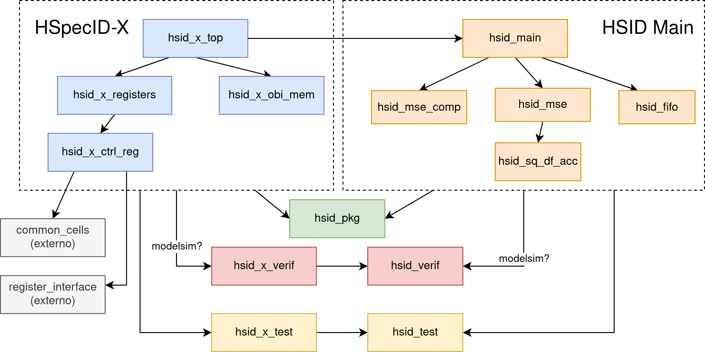
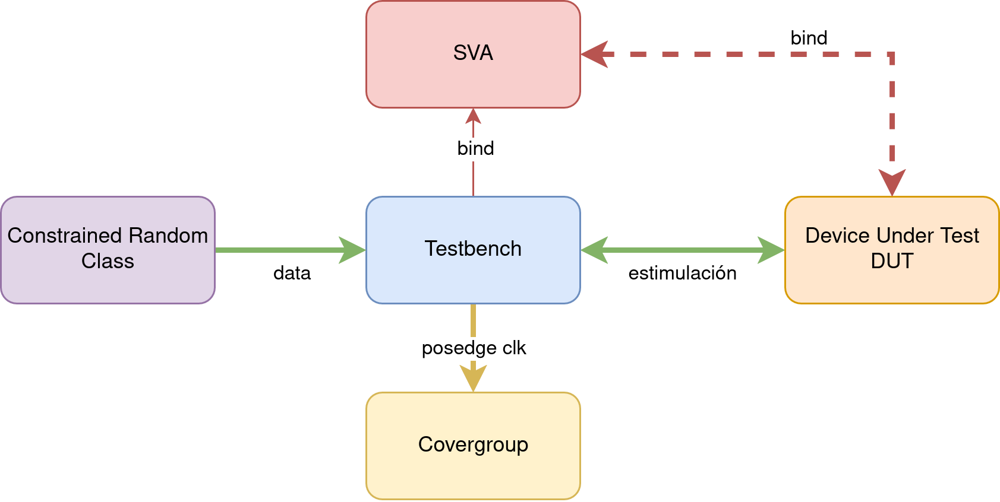

# Simulation and Verification process

## Modules and Simulation with FuseSoC

The accelerator design is modular, with each block described using a `.core`
configuration file in FuseSoC. These files define the module, its dependencies,
and the source files required for simulation and synthesis. This approach
enables FuseSoC to simplify module integration, promote code reuse, and support
portability across different simulation environments.

These `.core` files are located in the project’s root directory. Dependencies
between modules are represented in the graph shown in figure below. The modules
described in the *HSpecID-X* and *HSID Main* sections declare the RTL code
introduced in the [arquitecture](../architecture.md), as well as the appropriate
*targets* for simulation and coverage analysis via FuseSoC. Each module can be
simulated independently, as detailed in [development](../development.md).

{ width=95% }

The `hsid_pkg` module contains the SystemVerilog packages with type definitions
(`typedef`), parameters, and structures used throughout the project. It also
defines the structures required for accessing the OBI and *Register Interface*.

The `test` and `verif` modules are kept separate to facilitate code reuse across
different *testbenches*. For example, this enables class inheritance in random
data generation and sharing common SystemVerilog `tasks`.  Additionally, the
`verif` modules (which include the SVA) are used exclusively with the QuestaSim
simulator, as Vivado does not support certain advanced verification features.

External modules consist of third-party RTL code imported using the
[Bender](https://github.com/pulp-platform/bender) tool. Bender retrieves the
code directly from a `git` repository at the specified version.  Configuration
details are provided in the [development](development.md) section.  If an
external repository does not include a `.core` file, one must be created
manually.

## Testbench Structure

Each module includes its own *testbench*, which stimulates the RTL in various
ways to verify correct behavior under both functional and dataflow constraints.
Although adapted to the specific requirements of each module, all *testbenches*
share a common structure, as illustrated in the figure below.

{ width=95% }

The *testbenches* are written in SystemVerilog and typically include:

- Instantiation of the module under test (DUT)  
- Binding of the DUT to its corresponding SVA module  
- Definition of a coverage group (`covergroup`)  
- Instantiation of a random data generation class  
- A 10 ns period clock generator  

During initialization, the input signals to the DUT are set, a 5 ns *reset* is
applied, and the defined tests are executed.

Stimulus signals are applied with a 2 ns offset before the rising edge of the
clock. This offset simplifies debugging and enhances compatibility with SVA by
ensuring that input signals are stable at the rising edge.

### Constrained Random Class

The DUT can be stimulated using either directed tests or randomized data.
Directed tests allow full control over the inputs, while random data generation
enables extensive test coverage without explicitly defining each scenario.

However, random data must be constrained to avoid unrealistic or conflicting
conditions. Constraints can also be tuned to target edge cases by assigning
probabilities to specific conditions. For example, the generation of an HSP and
a reference signature can be achieved using the code shown the listing below.

```sv
rand logic [HSP_BANDS_WIDTH-1:0] hsp_bands;
rand logic [DATA_WIDTH-1:0] vctr1 [];
rand logic [DATA_WIDTH-1:0] vctr2 [];
...
constraint c_hsp_bands {
  hsp_bands dist {1:=15, MAX_HSP_BANDS:=15, [2:MAX_HSP_BANDS-1]:/70};
}
constraint c_vctrs {
  vctr1.size == hsp_bands;
  vctr2.size == hsp_bands;
  foreach (vctr1[i]) vctr1[i] dist {0:=15, MAX_DATA:=15, [1:MAX_DATA-1]:/70};
  foreach (vctr2[i]) vctr2[i] dist {0:=15, MAX_DATA:=15, [1:MAX_DATA-1]:/70};
}
```

Expected output values are computed using reference (*golden*) models, which
receive the same input as the DUT and are used to compare the resulting outputs.

All of this functionality is implemented using SystemVerilog classes that apply
the `rand` and `constraint` keywords. These classes are inherited and reused
across modules to avoid redundancy.

Randomization classes, constraints, and *golden models* are stored in each
module’s `tb` directory, with filenames ending in `_random.sv`.

### Coverage

Coverage analysis provides insight into which portions of code have been
exercised during simulation, as well as which combinations of DUT inputs have
been verified. This information is extracted automatically using the QuestaSim
simulator.

Before simulation, the compiled design must be optimized using the
`tcl` command shown in the listing below. The `+acc` option enables visibility
into internal signals, and the `+cover=bcesxf` option enables code coverage
collection for: *Branches* (`b`), *Conditions* (`c`), *Expressions* (`e`),
*Statements* (`s`), *Extended Toggles* (`x`), and *Finite State Machines* (`f`).

```tcl
vopt +acc +cover=bcesxf $top -o $top_opt
```

After simulation, the QuestaSim graphical interface can be used to inspect
module-level coverage. Coverage reports can also be exported in text or HTML
format.

Based on the coverage results, input stimuli can be refined to ensure full
functional stimulation and improve the overall coverage percentage. To support
this process, the `covergroups` defined in each *testbench* capture activity on
every rising clock edge, enabling detection of both covered and untested cases.

### SystemVerilog Assertions (SVA)

SVA are implemented in files separate from the RTL, following best practices in
verification methodology. Dedicated modules with the `_sva` suffix are created,
each exposing as ports all inputs, outputs, and internal signals of the
corresponding DUT.

Within each SVA module, *properties* are defined to specify expected behaviors
under given conditions. These are **concurrent assertions**, meaning they are
continuously evaluated during simulation. The listing below shows an example that
demonstrates how to declare a property, bind it to an `assert` statement, and
monitor it using a `cover`.

```sv
property mse_valid_after_band_pack_last;
  @(posedge clk) disable iff (!rst_n || clear) 
    band_pack_last && band_pack_valid |->
    ##3 compute_acc_sum_en
    ##1 compute_mse_en
    ##1 mse_valid && mse_ref == $past(hsp_ref, 5)
    ##1 !mse_valid
endproperty

assert property (mse_valid_after_band_pack_last) 
  else $error("MSE valid signal is not asserted when expected");
cover property (mse_valid_after_band_pack_last);
```

The binding between the DUT and the corresponding SVA module is performed in the
*testbench* using the `bind` statement. This binding is active only when
simulations are run with `vsim`, as `xsim` does not support many of the advanced
SVA features. An example of such a binding for the `hsid_main` module is shown
in the listing below. This connection is particularly important, as it enables
assertion checking across the DUT and all its submodules.

```sv
`ifdef MODEL_TECH
  // Binding SVA assertions to the DUT
  bind hsid_main_fsm hsid_main_fsm_sva #(
    .WORD_WIDTH(WORD_WIDTH),
    .HSP_BANDS_WIDTH(HSP_BANDS_WIDTH),
    .HSP_LIBRARY_WIDTH(HSP_LIBRARY_WIDTH)
  ) hsid_main_fsm_sva_inst (.*);

  bind hsid_mse hsid_mse_sva #(
    .WORD_WIDTH(WORD_WIDTH),
    .DATA_WIDTH(DATA_WIDTH),
    .DATA_WIDTH_MUL(DATA_WIDTH_MUL),
    .DATA_WIDTH_ACC(DATA_WIDTH_ACC),
    .HSP_BANDS_WIDTH(HSP_BANDS_WIDTH),
    .HSP_LIBRARY_WIDTH(HSP_LIBRARY_WIDTH)
  ) hsid_mse_sva_inst (.*);

  bind hsid_sq_df_acc hsid_sq_df_acc_sva #(
    .DATA_WIDTH(DATA_WIDTH),
    .DATA_WIDTH_MUL(DATA_WIDTH_MUL),
    .DATA_WIDTH_ACC(DATA_WIDTH_ACC)
  ) hsid_sq_df_acc_sva_inst (.*);

  bind hsid_mse_comp hsid_mse_comp_sva #(
    .WORD_WIDTH(WORD_WIDTH),
    .HSP_LIBRARY_WIDTH(HSP_LIBRARY_WIDTH)
  ) hsid_mse_comp_sva_inst (.*);

  bind hsid_fifo hsid_fifo_sva #(
    .WORD_WIDTH(WORD_WIDTH),
    .FIFO_ADDR_WIDTH(FIFO_ADDR_WIDTH)
  ) hsid_fifo_sva_inst (.*);
`endif
```

Additionally, immediate assertions are included in the *testbenches* to ensure
that DUT outputs match those of the *golden model*. The listing below shows an
example of such an assertion applied to checking FIFO output behavior.

```sv
a_fifo_data_out: assert (fifo_data_out == fifo_value_expected) else begin
  $error("Error: Read data isn't correct. Read data: %h, Expected: %h",
  fifo_data_out, fifo_value_expected);
end
```